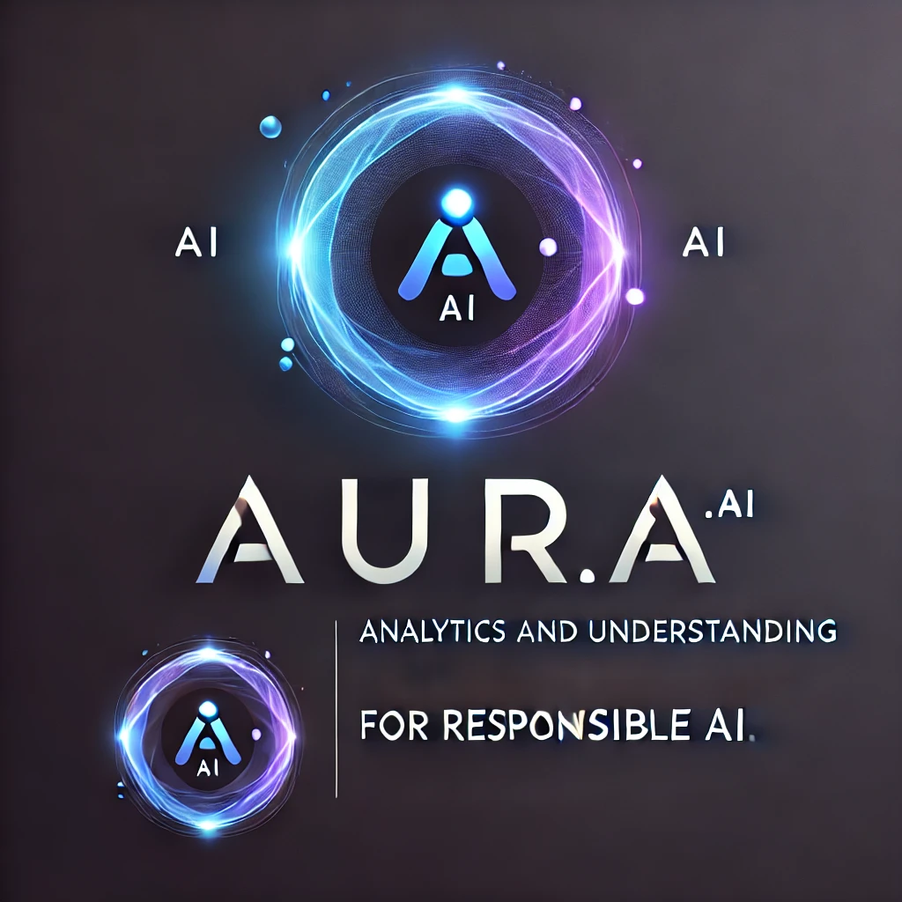

<center>
  <p align="center">
      
  </p>
  <h1>AURA - Analytics and Understanding for Responsible AI</h1>
</center>

AURA is an Azure AI-based web application designed to detect hallucinations and ensure integrity across various AI models and LLMs. It provides confidence scores, complete reasoning, detailed analytics along with bias, violence, sexual and self harm, and visualizations by comparing outputs with external knowledge sources.

Key unique selling points of AURA include multi-model support (e.g., GPT-4, GPT-4o, GPT-4o-mini, GPT-35-turbo-16k), analysis of True/False negatives and positives, a user-friendly interface, detailed analytics, and a ready-to-use hosted platform. The solution leverages Azure technologies like Azure App Service, Azure Blob Storage, Azure AI Search, Azure Document Intelligence, Azure OpenAI, Bing Search API, Azure AI Evaluators, Azure Cosmos DB, Azure AI Foundry, and Azure Container Registry.

Additionally, AURA features a RAG (Retrieval-Augmented Generation) capability, enabling users to upload their own knowledge bases in formats like PDFs, TXT, and DOCs and query information based on these custom sources. This enhances the system's adaptability and ensures more accurate and relevant outputs tailored to the user's specific needs.

<a href="https://auraai.azurewebsites.net/" target="_blank">
  
</a>
&nbsp;&nbsp;&nbsp;&nbsp;&nbsp;&nbsp;&nbsp;&nbsp;&nbsp;&nbsp;
<a href="https://github.com/arunpranav-at/aura.ai" target="_blank">
  
</a>
&nbsp;&nbsp;&nbsp;&nbsp;&nbsp;&nbsp;&nbsp;&nbsp;&nbsp;&nbsp;
<a href="https://youtu.be/RqOZ-0-wMjk" target="_blank">
  
</a>
<br/><br/>

# **Table of Contents**

1. [Features](#features)
2. [Working](#working)
3. [Architecture](#architecture)
4. [Azure Technologies Used](#azure-technologies-used)
5. [Technologies Used](#technologies-used)
6. [Proposal](#proposal)
7. [Team Members](#team-members)
8. [Contributing](#contributing)
   - [Development](#development)
9. [License](#license)

# Features

- **Response Evaluation**: Analyzes every response to determine whether it is hallucinated or not, ensuring high-quality outputs.  
- **Multiple Model Support**: Supports a wide range of models, including GPT-4, GPT-4o, GPT-4o-mini, GPT-35-Turbo-16k, and custom LLMs.
- **Bias and Content Evaluation**: Calculates metrics for violence, self-harm, sexual content, and bias in model responses, presenting these insights in detailed analytics.  
- **Detailed Analytics**: Provides comprehensive AI evaluation metrics, including hallucination percentages, confidence scores, reasoning explanations, and content safety metrics.  
- **Confusion Matrix**: Visualizes true/false positives and negatives for enhanced interpretability of model performance.
- **User-Friendly Interface**: Intuitive design with hosted platform access for ease of use.  
- **User Accounts and History**: Allows users to create accounts to store chat history, access detailed analytics, and perform contextual queries based on past interactions.  
- **RAG (Retrieval-Augmented Generation)**: Enables users to upload custom knowledge bases (e.g., PDFs, TXT, DOCs) and query them directly for personalized results.  
- **Integration with Azure Technologies**: Built entirely using Azure services like Azure App Service, Azure OpenAI, Azure Blob Storage, Azure AI Search, Azure Document Intelligence, Bing Search API, Azure AI Evaluators, Azure Cosmos DB, Azure AI Foundry, and Azure Container Registry for scalability and reliability.  
- **Real-Time Comparisons**: Compares model outputs with external knowledge sources for integrity and accuracy verification.  
- **Visualization Tools**: Includes charts, graphs, and dashboards for clear representation of analytics and evaluation results.  
- **Customizability**: Allows organizations to integrate their unique data and LLMs to meet specific requirements.

# Working

AURA is a comprehensive framework and user-friendly service designed to detect hallucinations in AI-generated outputs and validate them against trusted external data sources or user-provided knowledge bases. The platform evaluates every response for hallucinations, providing detailed metrics, including false positive and false negative rates, to assess detection accuracy.  

AURA seamlessly integrates with multiple external knowledge sources to ensure the integrity of AI model outputs. The platform offers robust analytics, including hallucination percentages, confidence scores, and content safety evaluations (e.g., violence, self-harm, sexual content, and bias), enabling users to gain deeper insights into model behavior.  

The system supports multi-model integration (e.g., GPT-4, GPT-4o, GPT-4o-mini, GPT-35-Turbo-16k, and custom LLMs), ensuring adaptability across diverse AI use cases. Its RAG (Retrieval-Augmented Generation) feature allows users to upload custom knowledge bases in formats like PDFs, TXT, and DOCs for targeted validation and queries.  

AURA includes advanced visualization tools, such as confusion matrices, charts, and dashboards, to represent hallucination metrics and performance analytics effectively. Built entirely on Azure technologies like Azure App Service, Azure OpenAI, Bing Search API, Azure AI Evaluators, Azure Cosmos DB, Azure AI Foundry, and Azure Container Registry, the platform ensures seamless scalability, reliability, and integration for enterprise use.  

With features like detailed analytics, multi-model support, real-time validation, and a user-friendly interface, AURA sets a new standard in AI evaluation by delivering transparency, accountability, and adaptability for AI-powered solutions.

# Architecture


# Azure Technologies Used

Azure offers a comprehensive ecosystem to develop, deploy, and integrate services seamlessly. With its SDKs, libraries, and deployment tools, Azure enhances development productivity while supporting scalable and reliable deployments.  

1. **Azure App Service**:  
   Facilitates containerized deployment of the frontend (Next.js application) and backend (FastAPI server) with Docker. Deployment is automated using GitHub Actions and integrated with Azure Container Registry for efficient management.  

2. **Azure Cosmos DB**:  
   Stores user data for authentication, chat history, analytics, and model test results. It leverages MongoDB APIs for efficient querying, storage of large datasets, and streamlined analytics and aggregation.  

3. **Azure OpenAI**:  
   Integrates multiple Azure-hosted GPT models for robust language understanding and output generation. API keys and endpoints simplify querying and model access.  

4. **Azure AI Foundry**:  
   Orchestrates multiple LLMs for efficient processing and provides endpoints for various models hosted via Azure OpenAI.  

5. **Azure AI Service**:  
   Enhances the platform with pre-built AI capabilities, including sentiment analysis and anomaly detection.  

6. **Azure Bing Search API**:  
   Acts as the primary tool for extracting information from external knowledge sources. This data is crucial for validating AI-generated outputs and identifying hallucinations, with or without contextual input.  

7. **Azure Container Registry**:  
   Manages Docker containers for the frontend and backend, ensuring streamlined continuous deployment and faster transitions from development to production environments.  

8. **Azure SDK for Python**:  
   Enables authentication with Azure services from the backend and integrates the AI Evaluator, responsible for identifying issues such as bias, violence, or other content-related concerns in AI outputs using Azure OpenAI.  

9. **Azure Cognitive Services**:  
   Powers advanced features like natural language understanding and computer vision to provide deeper insights and enhanced analytics.  

10. **Azure Blob Storage**:  
    Stores documents uploaded for custom knowledge base querying, supporting formats like PDFs, TXT, and DOCs. This ensures efficient management and retrieval of user-specific knowledge sources.  

11. **Azure AI Search**:
    Facilitates real-time querying and retrieval of information from custom knowledge bases, enhancing the RAG functionality and improving response accuracy.

12. **Azure Document Intelligence**:
    Automates the extraction and analysis of data from uploaded documents (e.g., PDFs, DOCs) to enrich the knowledge base and provide more relevant results.


# Technologies Used

1. **Visual Studio Code (VSCode)**:  
   A powerful and widely-used IDE that streamlines development with features like IntelliSense, integrated debugging, and seamless extensions. Git integration, Azure tools, and Docker support make it an essential tool for efficient development workflows.  

2. **GitHub Copilot**:  
   AI-powered code completion that accelerates development by generating intelligent code suggestions and boilerplate code snippets, enabling developers to focus on core logic and productivity.  

3. **Next.js**:  
   Powers the frontend with a dynamic and responsive web application. It leverages TailwindCSS for responsive design and `react-chartjs` for interactive, informative data visualizations of analytics.  

4. **Python**:  
   Forms the backend's backbone, offering a robust ecosystem for seamless integration with libraries such as LangChain and Azure SDK for Python, ensuring efficient handling of AI workflows and Azure services.  

5. **FastAPI**:  
   Enables rapid development of performant, asynchronous RESTful APIs with strong typing using Pydantic. It handles user authentication and acts as a bridge between Azure services and the frontend.  

6. **MongoDB**:  
   A NoSQL database used for flexible and scalable data storage, including user information, chat history, and analytics. Leveraged via Azure CosmosDB using the `motor` library for asynchronous processing and enhanced performance.  

7. **GitHub**:  
   Centralized version control for collaborative development. GitHub Actions enable continuous integration and deployment (CI/CD) of the frontend and backend to production using Azure CLI and Docker.  

8. **Docker**:  
   Facilitates containerized application development and deployment, ensuring a conflict-free and consistent development environment. Docker Compose is used for multi-container orchestration, enhancing local development and testing.  

9. **LangChain**:  
   Streamlines the orchestration of multiple LLMs, enabling efficient response generation for prompts with or without context, enhancing the application's AI capabilities.

## Frontend

The frontend of AURA is responsible for the following features:

1. **Authentication:**
   AURA supports both unauthenticated users, allowing them to test the platform without chat history, and authenticated users who can access their chat history for a seamless experience. User account creation is supported.

2. **Prompts to LLMs:**
   AURA allows users to prompt several LLM models such as:
   - GPT-4
   - GPT-3.5-Turbo
   - GPT-4o
   - GPT-4o-mini  
   Based on specific accuracy requirements, users can evaluate hallucinations across multiple models and gather performance analytics.

3. **Model Testing:**
   AURA facilitates model testing by providing prompts with and without context. The backend processes these prompts, delivering confusion matrix visualizations to help users interpret results.

4. **Analytics:**
   AURA features an interactive dashboard displaying various metrics, such as hallucination rates, self-harm, sexual content, violence, and bias, offering insightful visualizations for comprehensive analysis.

5. **RAG (Retrieval-Augmented Generation):**
   The frontend allows users to upload custom knowledge sources in formats like PDFs, TXT, and DOCs for contextual querying. This feature enhances the accuracy of LLM responses by incorporating external knowledge into the generation process. The frontend provides an intuitive interface for uploading and querying these knowledge bases.

## Backend

The backend of AURA is responsible for the following features:

1. **Authentication:**
   AURA's backend uses JWT-based authentication for secure access. It supports both authenticated and unauthenticated users, allowing users to freely explore the platform while ensuring that authenticated users can access their chat history.

2. **Response Generation:**
   The backend processes the user-provided prompts and integrates them with the chosen LLMs. For authenticated users, chat history is saved for future reference, enabling consistent and meaningful interactions.

3. **Hallucination Evaluation by Checking for Groundedness:**
   Hallucination detection is powered by the **Azure AI Evaluator**, facilitated by the **Azure SDK for Python**. This integration evaluates both with and without context, testing the groundedness of model outputs.

4. **Context Generation:**
   Context is generated using **Bing Search API**, enabling the platform to retrieve relevant external knowledge to validate the LLM responses. This process supports the detection of hallucinations by grounding the model’s output against reliable sources.

5. **Analytics:**
   The backend provides detailed analytical data for visualization on the frontend. Data is aggregated from **Azure Cosmos DB**, which stores user interactions, analytics, and model test results, allowing for in-depth evaluation and insights.

6. **RAG (Retrieval-Augmented Generation):**
   The backend powers the **RAG** feature, enabling the retrieval of user-provided knowledge bases for custom queries. These documents (e.g., PDFs, TXT, DOCs) are uploaded to **Azure Blob Storage** and processed by the backend to enhance the relevance of AI responses. The integration of **Azure Cognitive Search** allows users to search these documents efficiently, ensuring that queries are answered with tailored and accurate information.

# Proposal

We propose to integrate our hallucinator predictor with Azure AI Studio for evaluation by integration of external data sources that can be used for validation of responses from models, which will be useful for enhancement of accuracy of LLMs over time through intensive analytics. This will be useful for monitoring performance metrics of LLMs provided by Azure AI Foundry, aiding in reduction of AI hallucinations present in early stages of adoption of AI

# Team Members

1. **Aruthra S**  
   - [GitHub](https://github.com/AruthraS)  
   - [LinkedIn](https://www.linkedin.com/in/aruthra-s-66b97b256/)  

2. **R S Kierthana**  
   - [GitHub](https://github.com/KierthanaRS)  
   - [LinkedIn](https://www.linkedin.com/in/kierthana-rajesh-8b8b42256/)  

3. **Arun Pranav A T**  
   - [GitHub](https://github.com/arunpranav-at)  
   - [LinkedIn](https://www.linkedin.com/in/arunpranavat/)  

4. **Keerthana R**  
   - [GitHub](https://github.com/grittypuffy)  
   - [LinkedIn](https://www.linkedin.com/in/keerthana304/)

# Contributing

We welcome contributions, expecially for improving our hallucination prediction and context generators, for building a robust ecosystem that aids in reduction of hallucinations in AI.
Contributions can involve feedback, reporting of bugs on our platform, documentation, design, code or infrastructure.

For contributing code or documentation, check below:

## Development

AURA is structured as a **monorepo**, organized as follows:

- **Frontend:** Built using Next.js for a dynamic and user-friendly web interface.
- **Backend:** RESTful APIs developed with Python and FastAPI.

### Prerequisites

- [Docker](https://www.docker.com/) and Docker Compose for containerized development

### Steps to Run Locally

1. Verify Docker and Docker Compose are installed:
   ```shell
   docker -v
   docker compose version
   ```
2. Clone the repository and set up environment variables as per the `.env.sample` for the frontend and backend.
   ```shell
   git clone https://github.com/arunpranav-at/aura.ai
   cd aura.ai
   touch frontend/.env
   touch backend/.env
   ```
3. Build and start the services:
   ```shell
   docker compose --env-file frontend/.env --env-file backend/.env up --build
   ```

For more information regarding local development, check out the README for [frontend](/frontend/README.md) and [backend](/backend/README.md)


# License

AURA is licensed under MIT license, thus allowing permissive usage for your needs.